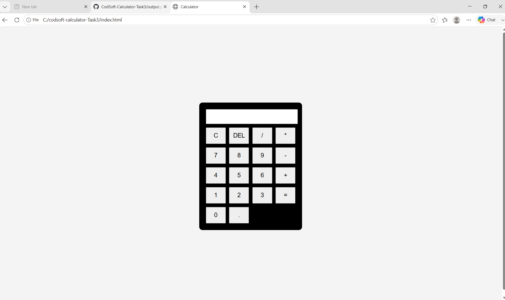

🧮 Calculator Web Application
This project is a Simple Calculator Web Application created as part of the CODSOFT Web Development Internship - Task 3.

The calculator performs basic arithmetic operations like Addition

Subtraction

Multiplication

Division

Percentage

📌 Intern Details
Name:GOGULAPATI LAKSHMI POORNIMA

Intern Id:BY26RY206292

Domain:Web Development

Organization:CodSoft

🚀 Project Description

The Calculator Web Application allows users to perform basic mathematical calculations through a simple and user-friendly interface.

Users can enter numbers and select arithmetic operations to instantly get results.

The project helps in understanding the basics of DOM manipulation, event handling, and JavaScript logic.

✨ Features
Perform addition, subtraction, multiplication, and division

Clear display functionality

Simple and clean user interface

Instant calculation results

Responsive button layout

🛠️ Technologies Used

HTML – Structure of the calculator

CSS – Styling and layout

JavaScript – Calculator functionality

## 🌐 Live Demo

👉 https://poornimagogulapati-a11y.github.io/codsoft-calculator-Task3/

## 📸 Project Output

